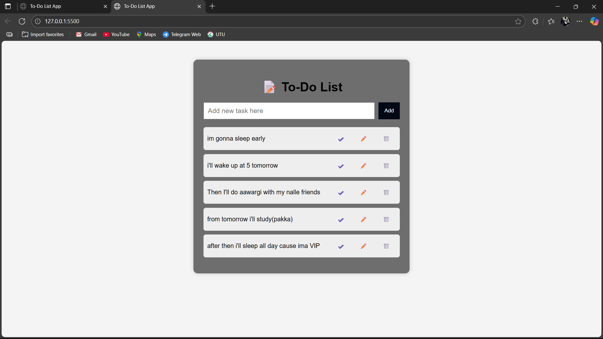

# 📝 CodeAlpha Project - To-Do List Web App

This is a simple and responsive **To-Do List Web Application** built as part of the CodeAlpha Internship. It helps users manage daily tasks with features like adding, editing, deleting, and marking tasks as complete.

## 🚀 Live Demo

🔗 [Click here to try it live](https://panditt76.github.io/CodeAlphaProject_To-Do-List/)

## 📸 Preview



## ✨ Features

- Add new tasks
- Mark tasks as completed
- Edit existing tasks
- Delete tasks
- Persist tasks using `localStorage`
- Pop-up alerts for task creation
- Fully responsive design

## 🛠️ Tech Stack

- HTML
- CSS
- JavaScript

## 📁 Folder Structure

```bash
/
├── index.html
├── style.css
├── script.js
├── todo.png
└── README.md
🙌 Contributed by
Abhay Vishwakarma
